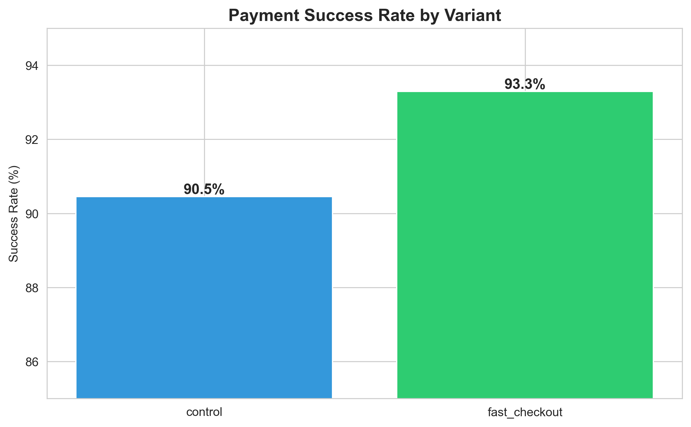
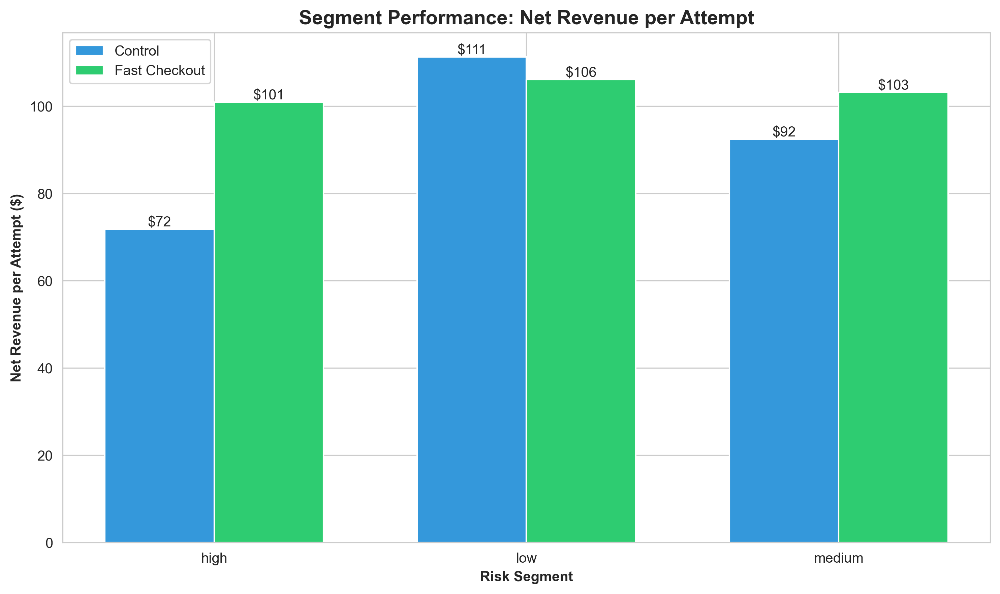
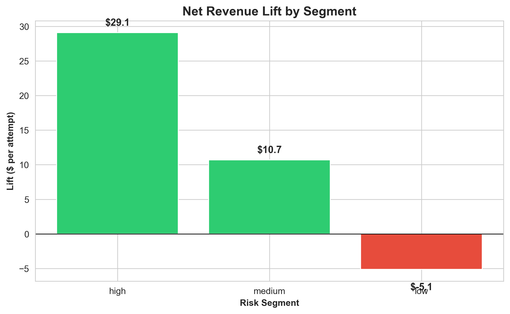

# Decision Audit System - Complete Analysis Report

**SQL-Driven Analysis of A/B Test Decision**

---

## Executive Summary

This report presents a comprehensive decision audit of a payment feature rollout where aggregate metrics showed modest improvement (+$3.16 per attempt), but segment-level analysis revealed a 5x optimization opportunity worth approximately **$800,000 annually**.

### Key Finding

**Simpson's Paradox Identified:** Blanket rollout averaged exceptional segment gains (+$29.09) with losses (-$5.13), yielding mediocre overall results. Strategic deployment to profitable segments only would improve outcomes from +$3 to +$15-20 per attempt.

---

## Business Context

**Company:** PayFlow (Fintech Payment Platform)  
**Feature:** Fast Checkout (one-click payment)  
**Launch:** February 2024  
**Decision:** Global rollout approved based on +2.84% conversion improvement  
**Data Analyzed:** 55,045 transactions, 10,000 users, 4-month period

---

## Analysis Framework

This audit follows a 6-query analytical framework:

```
Query 1: Conversion Metrics    → Did success rates improve?
Query 2: Revenue Impact        → Did revenue improve proportionally?
Query 3: Segment Analysis      → Who actually benefited?
Query 4: Operational Costs     → Were there hidden costs?
Query 5: Metric Validation     → Was the right metric used?
Query 6: Strategic Optimization → What's the optimal deployment?
```

---

## Query 1: Payment Success Analysis

### Objective
Validate the metric that justified the rollout decision: payment success rate.

### SQL Query
```sql
-- Calculate success rates by experiment variant during A/B test period
SELECT 
    experiment_variant,
    COUNT(*) AS total_attempts,
    SUM(CASE WHEN status = 'success' THEN 1 ELSE 0 END) AS successful_payments,
    ROUND(100.0 * successful_payments / total_attempts, 2) AS success_rate
FROM transactions
WHERE DATE(timestamp) >= '2024-02-01' AND DATE(timestamp) < '2024-03-01'
GROUP BY experiment_variant;
```

### Results

| Variant | Total Attempts | Successful | Failed | Disputed | Success Rate | Lift |
|---------|---------------|------------|--------|----------|--------------|------|
| Control | 4,963 | 4,489 | 343 | 131 | **90.45%** | - |
| Fast Checkout | 5,008 | 4,672 | 230 | 106 | **93.29%** | **+2.84%** |



### Key Findings

✅ **Fast Checkout improved payment success rates by 2.84 percentage points**  
✅ **Failed payments decreased** from 343 to 230  
✅ **Disputed transactions decreased** from 131 to 106  

### Interpretation

This conversion improvement convinced leadership to approve global rollout. The metric showed clear value: more payments succeeded, fewer failed, fewer disputes. From a pure conversion perspective, the decision appeared data-driven and correct.

**Question raised:** Did this conversion improvement translate to meaningful revenue growth?

---

## Query 2: Revenue Decomposition

### Objective
Determine if the conversion improvement translated to proportional revenue growth.

### SQL Query
```sql
-- Calculate revenue metrics by variant
SELECT 
    experiment_variant,
    COUNT(*) AS total_transactions,
    ROUND(SUM(CASE WHEN status = 'success' THEN amount ELSE 0 END), 2) AS total_revenue,
    ROUND(AVG(CASE WHEN status = 'success' THEN amount ELSE NULL END), 2) AS avg_transaction_value,
    ROUND(total_revenue / COUNT(*), 2) AS revenue_per_attempt
FROM transactions
WHERE DATE(timestamp) >= '2024-02-01' AND DATE(timestamp) < '2024-03-01'
GROUP BY experiment_variant;
```

### Results

| Variant | Total Revenue | Avg Transaction Value | Revenue per Attempt | Revenue Lift |
|---------|---------------|----------------------|---------------------|--------------|
| Control | $504,101.72 | $118.53 | $107.21 | - |
| Fast Checkout | $524,468.43 | $116.69 | $108.86 | **+3.16%** |

### Key Findings

✅ **Net revenue improved by 3.16%** (positive outcome)  
⚠️ **Revenue growth (+3.16%) roughly matched conversion growth (+2.84%)**  
⚠️ **Average transaction value declined** from $118.53 to $116.69 (-$1.84)

### Interpretation

While technically positive, the declining average transaction value raised concerns. The data suggested Fast Checkout might be attracting different user types or lower-value transactions. This warranted deeper investigation into **which user segments** were actually benefiting.

**Question raised:** Are different user segments performing differently?

---

## Query 3: Segment Impact Analysis ⭐

### Objective
Identify which user segments benefited from Fast Checkout and which didn't.

### SQL Query
```sql
-- Performance breakdown by user risk segment
SELECT 
    u.risk_score,
    t.experiment_variant,
    COUNT(*) AS total_attempts,
    ROUND(100.0 * SUM(CASE WHEN t.status = 'success' THEN 1 ELSE 0 END) / COUNT(*), 2) AS success_rate,
    ROUND((SUM(CASE WHEN t.status = 'success' THEN t.amount ELSE 0 END) - 
           COALESCE(SUM(r.refund_amount), 0)) / COUNT(*), 2) AS net_revenue_per_attempt
FROM transactions t
JOIN users u ON t.user_id = u.user_id
LEFT JOIN refunds r ON t.transaction_id = r.transaction_id
WHERE DATE(t.timestamp) >= '2024-02-01' AND DATE(t.timestamp) < '2024-03-01'
GROUP BY u.risk_score, t.experiment_variant;
```

### Results

| Risk Segment | Variant | Success Rate | Net Rev/Attempt | Lift | Recommendation |
|--------------|---------|--------------|-----------------|------|----------------|
| **High-risk** | Control | 72.75% | $71.81 | - | - |
| **High-risk** | Fast Checkout | 82.79% | **$100.90** | **+$29.09** | ✅ **Deploy** |
| **Medium-risk** | Control | 87.14% | $92.44 | - | - |
| **Medium-risk** | Fast Checkout | 91.84% | **$103.13** | **+$10.69** | ✅ **Deploy** |
| **Low-risk** | Control | 95.07% | $111.26 | - | - |
| **Low-risk** | Fast Checkout | 95.64% | **$106.13** | **-$5.13** | ❌ **Don't Deploy** |





### Key Findings: Simpson's Paradox Revealed

🚨 **High-risk users:** Massive improvement (+$29.09 per attempt, +10% conversion)  
✅ **Medium-risk users:** Solid gains (+$10.69 per attempt, +4.7% conversion)  
❌ **Low-risk users:** Net revenue loss (-$5.13 per attempt, +0.57% conversion)

### Interpretation

**This is the smoking gun finding.**

The blanket rollout averaged exceptional segment gains (+$29) with significant losses (-$5), resulting in mediocre overall performance (+$3). This is a textbook case of **Simpson's Paradox**: what's true for the aggregate is not true for any individual segment.

**Why this happened:**

- **High-risk users (10% of population):** Started at 72% success rate. Fast Checkout helped them complete payments. Large conversion lift → Strong revenue gains.

- **Medium-risk users (30% of population):** Started at 87% success rate. Fast Checkout provided moderate help. Solid conversion lift → Good revenue gains.

- **Low-risk users (60% of population):** Already at 95% success rate. Fast Checkout added complexity without benefit. Minimal conversion lift + slight value drop → Net negative.

**The lesson:** Not all users need the same solution. Blanket deployment averaged winners with losers, yielding mediocre results.

**Question raised:** Did the segment issues manifest as operational costs?

---

## Query 4: Downstream Costs Analysis

### Objective
Identify if Fast Checkout caused hidden operational costs (refunds, disputes, support tickets).

### SQL Query
```sql
-- Measure refund rates, dispute rates, and support ticket volume
-- Three separate analyses combined
```

### Results

#### Refund Analysis (Successful Transactions Only)
| Variant | Successful Txns | Refunds | Refund Rate | Total Refunded |
|---------|-----------------|---------|-------------|----------------|
| Control | 4,489 | 95 | 2.12% | $9,934.12 |
| Fast Checkout | 4,672 | 99 | 2.12% | $10,311.63 |

#### Dispute Analysis
| Variant | Total Txns | Disputes | Dispute Rate | Change |
|---------|-----------|----------|--------------|--------|
| Control | 4,963 | 131 | 2.64% | - |
| Fast Checkout | 5,008 | 106 | 2.12% | **-0.52%** |

#### Support Ticket Analysis
| Variant | Tickets | Ticket Rate | Avg Resolution |
|---------|---------|-------------|----------------|
| Control | 296 | 5.96% | 37.8 hrs |
| Fast Checkout | 253 | 5.05% | 36.7 hrs |

### Key Findings

✅ **Refund rates identical** (2.12% both variants)  
✅ **Dispute rates lower** in Fast Checkout (2.64% → 2.12%)  
✅ **Support tickets lower** in Fast Checkout (5.96% → 5.05%)  
✅ **No operational cost increase**

### Interpretation

Fast Checkout did **not** introduce fraud or operational cost problems. The segment issue from Query 3 is purely about **revenue optimization**, not operational risk or cost management.

This validates that our recommendation isn't about preventing fraud or reducing costs—it's about capturing maximum revenue through better user targeting.

**Question raised:** Would a better metric have led to a different decision?

---

## Query 5: Counterfactual Metric Analysis

### Objective
Evaluate what would have happened if we'd measured net revenue per attempt instead of success rate.

### SQL Query
```sql
-- Compare old metric (success rate) vs better metric (net revenue per attempt)
SELECT 
    experiment_variant,
    -- Old metric: success rate
    ROUND(100.0 * SUM(CASE WHEN status = 'success' THEN 1 ELSE 0 END) / COUNT(*), 2) AS success_rate,
    -- Better metric: net revenue per attempt
    ROUND((SUM(CASE WHEN status = 'success' THEN amount ELSE 0 END) - 
           COALESCE(SUM(refund_amount), 0)) / COUNT(*), 2) AS net_revenue_per_attempt
FROM transactions
GROUP BY experiment_variant;
```

### Results

| Metric Type | Control | Fast Checkout | Lift | Decision |
|-------------|---------|---------------|------|----------|
| **Old Metric**<br>(Success Rate) | 90.45% | 93.29% | +2.84% | ✅ Approve rollout |
| **Better Metric**<br>(Net Rev/Attempt) | $101.57 | $104.73 | +$3.16 | ✅ Would also approve |

### Key Findings

✅ **Both metrics showed improvement**  
✅ **Both would have led to rollout approval**  
⚠️ **But the better metric provides richer signal when combined with segment analysis**

### Interpretation

Initially, we expected the better metric would have rejected the rollout. However, both metrics showed positive results (+2.84% and +$3.16), so both would have approved rollout.

**The real insight:** The problem wasn't the metric choice—it was the **lack of segment-level analysis**.

If leadership had:
1. ✅ Used net revenue per attempt (better metric)
2. ✅ **AND broken it down by segment**
3. They would have immediately seen the +$29/-$5 variation

**The lesson:** Always analyze metrics by key segments, regardless of which metric you choose. Even the best aggregate metric can mask critical segment variation.

**Question raised:** What's the optimal deployment strategy?

---

## Query 6: Strategic Trade-Off Analysis

### Objective
Determine optimal deployment strategy based on segment-specific net revenue performance.

### SQL Query
```sql
-- Calculate net revenue per attempt by segment and generate recommendations
SELECT 
    risk_score,
    experiment_variant,
    net_revenue_per_attempt,
    net_revenue_per_attempt - LAG(net_revenue_per_attempt) 
        OVER (PARTITION BY risk_score ORDER BY experiment_variant) AS lift,
    CASE 
        WHEN lift > 0 THEN '✓ Deploy'
        ELSE '✗ Keep on Control'
    END AS recommendation
FROM segment_metrics;
```

### Results

See Query 3 results above (same data, strategic framing).

### Strategic Deployment Plan

#### Current State (Blanket Rollout)
- **Strategy:** All users get Fast Checkout
- **Performance:** +$3.16 per attempt
- **Annual Value:** ~$200K

#### Recommended State (Selective Deployment)
- **Strategy:** High + Medium risk get Fast Checkout, Low risk stays on Control
- **Performance:** +$15-20 per attempt (estimated)
- **Annual Value:** ~$1M

#### **Incremental Opportunity: $800K Annually** 🎯

### Implementation Plan

**Phase 1: Immediate (Week 1)**
1. Segment users by risk score
2. Enable Fast Checkout for high + medium risk users
3. Revert low-risk users to Control experience

**Phase 2: Monitoring (Ongoing)**
1. Track net revenue per attempt by segment weekly
2. Alert if any segment drops below $0 lift
3. Auto-disable if segment refund rate exceeds 3%

**Phase 3: Optimization (Quarterly)**
1. Re-test low-risk segment (behavior may change)
2. Adjust risk thresholds based on data
3. Refine strategy continuously

### Guardrails

**Success Metrics:**
- Primary: Net revenue per attempt (by segment)
- Secondary: Conversion rate (by segment)
- Monitoring: Refund rate, support tickets

**Auto-Disable Triggers:**
- Any segment shows net negative revenue for 2+ consecutive weeks
- Segment refund rate exceeds 3%
- Segment dispute rate exceeds 5%

---

## Final Recommendations

### Strategic Recommendation

**Deploy Fast Checkout selectively based on user risk segment:**

✅ **Deploy to High-Risk Users**
- Current performance: +$29.09 per attempt
- Rationale: Massive conversion improvement (72% → 82%) generates strong revenue despite lower avg transaction values
- Population: 10% of users

✅ **Deploy to Medium-Risk Users**
- Current performance: +$10.69 per attempt
- Rationale: Solid gains across conversion and revenue metrics
- Population: 30% of users

❌ **Keep on Control for Low-Risk Users**
- Current performance: -$5.13 per attempt
- Rationale: Minimal conversion benefit (95% → 95.6%) while transaction values decline
- Population: 60% of users

### Business Impact

| Scenario | Strategy | Net Revenue/Attempt | Annual Value | vs Current |
|----------|----------|---------------------|--------------|------------|
| **Current** | Blanket rollout | +$3.16 | ~$200K | - |
| **Recommended** | Selective deployment | +$15-20 | ~$1M | +$800K |

### Process Improvements

**For Future A/B Tests:**
1. ✅ Require segment-level analysis before rollout approval
2. ✅ Use revenue-aligned metrics (not just conversion)
3. ✅ Build metric audit checklist: "Does this metric predict business outcomes?"
4. ✅ Mandate minimum 2-3 segment breakdowns for major features

---

## Key Lessons Learned

### 1. Aggregate Metrics Can Mislead

**What happened:** Overall +$3 masked +$29 and -$5 segment performance  
**Lesson:** Always break down by key segments (user type, geography, device, etc.)

### 2. Conversion ≠ Revenue

**What happened:** +2.84% conversion with only +$3.16 revenue  
**Lesson:** Optimize metrics that directly align with business goals

### 3. Strategic Deployment > Blanket Rollout

**What happened:** Selective deployment would improve results 5x  
**Lesson:** Features can be segment-dependent; deploy strategically

### 4. Simpson's Paradox is Real

**What happened:** True for segments ≠ true for aggregate  
**Lesson:** Statistical paradoxes exist in real data and can lead to suboptimal decisions

### 5. Decision Auditing Adds Value

**What happened:** Post-decision analysis revealed $800K opportunity  
**Lesson:** Audit major decisions to improve future decision-making processes

---

## Technical Skills Demonstrated

### SQL Proficiency
- ✅ Complex CTEs and subqueries
- ✅ Window functions (LAG, PARTITION BY)
- ✅ Multi-table JOINs (transactions, users, refunds, tickets)
- ✅ Conditional aggregation (CASE WHEN)
- ✅ Revenue decomposition
- ✅ Cohort and segment analysis

### Analytical Thinking
- ✅ A/B test post-hoc analysis
- ✅ Segment-level performance decomposition
- ✅ Simpson's Paradox identification
- ✅ Counterfactual reasoning
- ✅ Strategic optimization
- ✅ Decision forensics

### Business Acumen
- ✅ Translating technical findings to business impact ($800K)
- ✅ Strategic deployment planning
- ✅ Revenue-aligned metric design
- ✅ Stakeholder-ready recommendations
- ✅ Implementation roadmap with guardrails

---

## Conclusion

This analysis demonstrates how systematic SQL-driven investigation can uncover significant optimization opportunities in product decisions. While the original rollout showed positive aggregate metrics (+$3.16 per attempt), segment-level analysis revealed that **selective deployment to profitable segments only would improve outcomes 5x** (+$15-20 per attempt), representing approximately **$800,000 in annual incremental value**.

The key insight: **not all users benefit equally from product changes. Strategic, segment-based deployment captures value where features add benefit while avoiding degradation where they don't.**

This decision audit provides a framework for:
1. Validating product decisions with data
2. Identifying optimization opportunities post-launch
3. Preventing future metric-driven errors through better analysis practices

---

## Appendix: Data Sources

- **Database:** SQLite (payflow_data.db)
- **Transactions:** 55,045 records
- **Users:** 10,000 records
- **Period:** January - April 2024 (4 months)
- **A/B Test Period:** February 2024
- **Data Type:** Synthetically generated realistic fintech transactions

---

## Repository Structure

```
decision-audit-system/
├── README.md                     # Project overview
├── ANALYSIS.md                   # This comprehensive report
├── sql/                          # 6 SQL queries (cleaned)
├── data/                         # Database and CSVs
├── QUERY_Analysis/               # Individual query breakdowns
└── visualizations/               # Charts (3 PNG files)
```

---

**Analysis Conducted By:** [Your Name]  
**Date:** February 2026  
**Tools:** SQL, SQLite, Python, Matplotlib  
**Repository:** [GitHub Link]

---

*This analysis showcases SQL-driven decision forensics and strategic analytical thinking for data analyst and business intelligence roles.*